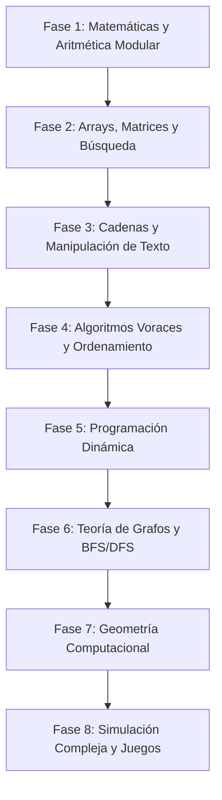

# Guía Maestra de Preparación para TCS CodeVita

Bienvenido a la **Guía Maestra de Preparación para TCS CodeVita**. Este documento detalla la estructura completa de la competencia, las fases de clasificación, el sistema de evaluación, las reglas críticas y la **ruta estratégica de estudio recomendada**, acompañada de un **catálogo integral de ejercicios clasificados por tema** provenientes de todas las ediciones históricas (Season 6 a Season 13 y ejercicios de práctica).

### Documentos Especiales Complementarios:
- 🚀 **[RUTA_OFICIAL_PREPARACION.md](RUTA_OFICIAL_PREPARACION.md)**: Hoja de ruta oficial de estudio paso a paso por niveles (Nivel 1 a Nivel 6), plantillas de Fast I/O y sintaxis imprescindible para C++, Python y Java.
- ✅ **[CHECKLIST_ORDEN_EJERCICIOS.md](CHECKLIST_ORDEN_EJERCICIOS.md)**: Checklist maestro interactivo con el orden secuencial de resolución (desde MockVita hasta Grand Finale) con casillas marcables `[ ]` $\rightarrow$ `[x]`.
- 🏆 **[GRAND_FINALE_PROBLEMS.md](GRAND_FINALE_PROBLEMS.md)**: Análisis exclusivo de la **Fase 3 (Grand Finale)**, por qué no aparece en GitHub y 4 problemas representativos de nivel mundial con soluciones.
- 📑 **[CORRELACION_60_PROBLEMAS.md](CORRELACION_60_PROBLEMAS.md)**: Mapeo y correlación de los 60 problemas del archivo histórico `60.md` dentro de nuestro repositorio.

---

## 1. ¿Qué es TCS CodeVita?

**TCS CodeVita** es la competencia global de programación competitiva organizada por *Tata Consultancy Services*, reconocida por el **Guinness World Records** como el concurso de programación más grande del mundo.

### Beneficios Clave:
1. **Reclutamiento Preferencial Directo**: Los competidores con mejor desempeño son invitados directamente a entrevistas de contratación técnica para perfiles de alto nivel (**TCS Digital** y **TCS Innovator / Turbo**), saltándose filtros iniciales.
2. **Reconocimiento Global**: Clasificar a rondas avanzadas sitúa al candidato entre el 1% superior de programadores competitivos a nivel internacional.
3. **Premios en Efectivo y Trofeos**: La final global otorga premios monetarios significativos a los mejores finalistas individuales y por países.

---

## 2. Fases de la Competencia

### Fase 1: Pre-Qualifier / Round 1 (Ronda Zonal)
- **Duración**: 6 horas continuas.
- **Formato**: Generalmente 6 problemas que van desde nivel básico hasta avanzado.
  - **Problema A y B (Nivel Fácil/Medio-Bajo)**: Típicamente ad-hoc, simulación directa, cadenas básicas o matemáticas elementales.
  - **Problema C y D (Nivel Medio/Intermedio)**: Programación dinámica, grafos con BFS/DFS, búsqueda binaria sobre respuesta o geometría 2D.
  - **Problema E y F (Nivel Avanzado/Difícil)**: Estructuras avanzadas (DSU, Segment Tree), Dijkstra con optimizaciones, DP con máscaras de bits o simulaciones de física/juegos.
- **Estrategia recomendada**: Resolver 2 a 3 problemas completos con rapidez y sin penalizaciones por envíos erróneos suele garantizar el pase a la siguiente ronda y entrevista.

### Fase 2: Qualifier / Round 2 (Ronda Regional / Nacional)
- **Duración**: 6 horas continuas.
- **Formato**: 6 a 8 problemas significativamente más exigentes. Se evalúan algoritmos avanzados, límites de tiempo estrictos (1.0 segundo) y casos borde masivos.
- **Objetivo**: Seleccionar a los mejores finalistas de cada país/región para viajar o conectarse a la final mundial.

### Fase 3: Grand Finale / Round 3 (Final Mundial)
- **Sede**: Presencial en sedes principales de TCS en India (con gastos cubiertos) o virtual sincronizada para finalistas internacionales.
- **Dinámica**: Problemas de nivel internacional estilo ICPC World Finals, con tabla de posiciones en vivo (scoreboard congelado en la última hora). Ver detalles técnicos en [GRAND_FINALE_PROBLEMS.md](GRAND_FINALE_PROBLEMS.md).

---

## 3. Reglamento, Plataforma y Reglas Críticas

### A. Sistema de Puntuación y Ranking
1. **Criterio Principal**: Número de problemas resueltos (100% de casos de prueba superados; no suele haber puntaje parcial en rondas iniciales).
2. **Criterio de Desempate (Penalty Time)**: La suma del tiempo (en minutos) desde el inicio del concurso hasta el envío exitoso de cada problema, más una penalización de tiempo fija por cada intento previo que resultó en error (WA, TLE, RTE).

### B. Detección Estricta de Plagio (Tolerancia Cero)
- TCS cuenta con un motor de detección de plagio extremadamente riguroso (**MOSS / CodeVita Anti-Plagiarism Engine**).
- Si dos envíos comparten estructura sintáctica idéntica, árbol sintáctico abstracto (AST) similar o patrones de soluciones publicadas en línea/IA durante la ventana del examen, **ambos participantes son descalificados de inmediato y vetados de futuras convocatorias de TCS**.

### C. Lenguajes Soportados y Recomendaciones
- **C++ (C++17 / C++20)**: *(Altamente recomendado)* Máxima velocidad de ejecución y amplia biblioteca STL (`vector`, `map`, `unordered_set`, `priority_queue`, `algorithm`).
- **Python (Python 3.8+)**: Excelente para problemas matemáticos con números grandes (`int` con precisión arbitraria) y prototipado rápido de strings. Para entrada masiva, use siempre `sys.stdin.read().split()` en vez de `input()`.
- **Java (Java 11 / 17)**: Muy robusto con `BigInteger` y `Collections`. Se recomienda utilizar `BufferedReader` y `StringTokenizer` para evitar TLE en lecturas de más de 10^5 elementos.

---

## 4. Ruta de Estudio Estratégica (Roadmap por Fases)

Para maximizar tu puntuación en CodeVita, estudia los temas en el siguiente orden secuencial:

---

## 5. Catálogo de Ejercicios por Tema y Ronda

A continuación se presenta el catálogo exhaustivo de los **452 ejercicios** del repositorio organizados por su tópico principal de estudio, indicando la Season, la Ronda exacta (`Round-1`, `Round-2`, `MockVita-2`) y si cuenta con material auténtico oficial (`⭐ [OFICIAL]`):

### 📂 Algoritmos Voraces (Greedy) y Programación de Intervalos (2 ejercicios — 2 oficiales)

- **[[OFICIAL]-CodeVita-60-Problems-Index](No-Season/Reference-Material/[OFICIAL]-CodeVita-60-Problems-Index/)** ⭐ `[OFICIAL]` — *(`No-Season / Reference-Material`)*
- **[[OFICIAL]-Greedy-Hostler-A](Season-6/Round-2/[OFICIAL]-Greedy-Hostler-A/)** ⭐ `[OFICIAL]` — *(`Season-6 / Round-2`)*

### 📂 Estructuras de Datos: Arrays, Matrices y Búsqueda (99 ejercicios — 26 oficiales)

- **[10ticket&chill](No-Season/Practice-Problems/10ticket&chill/)** — *(`No-Season / Practice-Problems`)*
- **[2taxationwoes](No-Season/Practice-Problems/2taxationwoes/)** — *(`No-Season / Practice-Problems`)*
- **[7x7-Sudoku](No-Season/Practice-Problems/7x7-Sudoku/)** — *(`No-Season / Practice-Problems`)*
- **[Atmmachine](No-Season/Practice-Problems/Atmmachine/)** — *(`No-Season / Practice-Problems`)*
- **[Bottlenecks](No-Season/Practice-Problems/Bottlenecks/)** — *(`No-Season / Practice-Problems`)*
- **[Calculatesalarypf-Notdone](No-Season/Practice-Problems/Calculatesalarypf-Notdone/)** — *(`No-Season / Practice-Problems`)*
- **[Christmastower](No-Season/Practice-Problems/Christmastower/)** — *(`No-Season / Practice-Problems`)*
- **[Clashofclans](No-Season/Practice-Problems/Clashofclans/)** — *(`No-Season / Practice-Problems`)*
- **[Codu-Loves-Sum](No-Season/Practice-Problems/Codu-Loves-Sum/)** — *(`No-Season / Practice-Problems`)*
- **[Coinsdistribution](No-Season/Practice-Problems/Coinsdistribution/)** — *(`No-Season / Practice-Problems`)*
- **[Collectingcandies(heapq)](No-Season/Practice-Problems/Collectingcandies(heapq)/)** — *(`No-Season / Practice-Problems`)*
- **[Compilerdesign](No-Season/Practice-Problems/Compilerdesign/)** — *(`No-Season / Practice-Problems`)*
- **[Constellation-Stars](No-Season/Practice-Problems/Constellation-Stars/)** — *(`No-Season / Practice-Problems`)*
- **[Count-Pairs](No-Season/Practice-Problems/Count-Pairs/)** — *(`No-Season / Practice-Problems`)*
- **[Decimals](No-Season/Practice-Problems/Decimals/)** — *(`No-Season / Practice-Problems`)*
- **[Diningtable](No-Season/Practice-Problems/Diningtable/)** — *(`No-Season / Practice-Problems`)*
- **[Distributebooks](No-Season/Practice-Problems/Distributebooks/)** — *(`No-Season / Practice-Problems`)*
- **[Drunkard](No-Season/Practice-Problems/Drunkard/)** — *(`No-Season / Practice-Problems`)*
- **[Dsf](No-Season/Practice-Problems/Dsf/)** — *(`No-Season / Practice-Problems`)*
- **[Employeehirarchy](No-Season/Practice-Problems/Employeehirarchy/)** — *(`No-Season / Practice-Problems`)*
- **[Examefficiency](No-Season/Practice-Problems/Examefficiency/)** — *(`No-Season / Practice-Problems`)*
- **[Getawaygala](No-Season/Practice-Problems/Getawaygala/)** — *(`No-Season / Practice-Problems`)*
- **[Integerarray](No-Season/Practice-Problems/Integerarray/)** — *(`No-Season / Practice-Problems`)*
- **[Integers](No-Season/Practice-Problems/Integers/)** — *(`No-Season / Practice-Problems`)*
- **[Jurassic-Park](No-Season/Practice-Problems/Jurassic-Park/)** — *(`No-Season / Practice-Problems`)*
- **[Lucasnos](No-Season/Practice-Problems/Lucasnos/)** — *(`No-Season / Practice-Problems`)*
- **[Marathonwinner](No-Season/Practice-Problems/Marathonwinner/)** — *(`No-Season / Practice-Problems`)*
- **[Mftrackerc](No-Season/Practice-Problems/Mftrackerc/)** — *(`No-Season / Practice-Problems`)*
- **[Minimize-The-Sum](No-Season/Practice-Problems/Minimize-The-Sum/)** — *(`No-Season / Practice-Problems`)*
- **[Minimum-Gifts](No-Season/Practice-Problems/Minimum-Gifts/)** — *(`No-Season / Practice-Problems`)*
- **[Minproductarray](No-Season/Practice-Problems/Minproductarray/)** — *(`No-Season / Practice-Problems`)*
- **[Numberpattern](No-Season/Practice-Problems/Numberpattern/)** — *(`No-Season / Practice-Problems`)*
- **[Oroperations](No-Season/Practice-Problems/Oroperations/)** — *(`No-Season / Practice-Problems`)*
- **[Pairwithdifferencek](No-Season/Practice-Problems/Pairwithdifferencek/)** — *(`No-Season / Practice-Problems`)*
- **[Pattern](No-Season/Practice-Problems/Pattern/)** — *(`No-Season / Practice-Problems`)*
- **[Patternprinting](No-Season/Practice-Problems/Patternprinting/)** — *(`No-Season / Practice-Problems`)*
- **[Petrolpump-Notdone](No-Season/Practice-Problems/Petrolpump-Notdone/)** — *(`No-Season / Practice-Problems`)*
- **[Pp1](No-Season/Practice-Problems/Pp1/)** — *(`No-Season / Practice-Problems`)*
- **[Practice](No-Season/Practice-Problems/Practice/)** — *(`No-Season / Practice-Problems`)*
- **[Savingforarainyday](No-Season/Practice-Problems/Savingforarainyday/)** — *(`No-Season / Practice-Problems`)*
- **[Sfklas](No-Season/Practice-Problems/Sfklas/)** — *(`No-Season / Practice-Problems`)*
- **[Single-Lane-Highway-Question](No-Season/Practice-Problems/Single-Lane-Highway-Question/)** — *(`No-Season / Practice-Problems`)*
- **[Sortingboxes](No-Season/Practice-Problems/Sortingboxes/)** — *(`No-Season / Practice-Problems`)*
- **[Stones](No-Season/Practice-Problems/Stones/)** — *(`No-Season / Practice-Problems`)*
- **[Swayamvar](No-Season/Practice-Problems/Swayamvar/)** — *(`No-Season / Practice-Problems`)*
- **[Televisionsets](No-Season/Practice-Problems/Televisionsets/)** — *(`No-Season / Practice-Problems`)*
- **[Testvita](No-Season/Practice-Problems/Testvita/)** — *(`No-Season / Practice-Problems`)*
- **[Uncommon-Element](No-Season/Practice-Problems/Uncommon-Element/)** — *(`No-Season / Practice-Problems`)*
- **[[OFICIAL]-Count-Greater-Elements](No-Season/Practice-Problems/[OFICIAL]-Count-Greater-Elements/)** ⭐ `[OFICIAL]` — *(`No-Season / Practice-Problems`)*
- **[[OFICIAL]-Edyst-Study-Material](No-Season/Reference-Material/[OFICIAL]-Edyst-Study-Material/)** ⭐ `[OFICIAL]` — *(`No-Season / Reference-Material`)*
- **[Countzero](Season-11/Round-1/Countzero/)** — *(`Season-11 / Round-1`)*
- **[Klaara'sfortress](Season-11/Round-1/Klaara'sfortress/)** — *(`Season-11 / Round-1`)*
- **[Supermarket](Season-11/Round-1/Supermarket/)** — *(`Season-11 / Round-1`)*
- **[Vipcafe](Season-11/Round-1/Vipcafe/)** — *(`Season-11 / Round-1`)*
- **[[OFICIAL]-Constellation](Season-11/Round-1/[OFICIAL]-Constellation/)** ⭐ `[OFICIAL]` — *(`Season-11 / Round-1`)*
- **[[OFICIAL]-Happy-Range-Count-Pairs](Season-11/Round-1/[OFICIAL]-Happy-Range-Count-Pairs/)** ⭐ `[OFICIAL]` — *(`Season-11 / Round-1`)*
- **[[OFICIAL]-Jugs-And-Cups](Season-11/Round-1/[OFICIAL]-Jugs-And-Cups/)** ⭐ `[OFICIAL]` — *(`Season-11 / Round-1`)*
- **[[OFICIAL]-Prize-Kitty](Season-11/Round-1/[OFICIAL]-Prize-Kitty/)** ⭐ `[OFICIAL]` — *(`Season-11 / Round-1`)*
- **[Minimumswap](Season-12/Round-1/Minimumswap/)** — *(`Season-12 / Round-1`)*
- **[Office-Rostering](Season-12/Round-1/Office-Rostering/)** — *(`Season-12 / Round-1`)*
- **[Plague](Season-12/Round-1/Plague/)** — *(`Season-12 / Round-1`)*
- **[Scorefcell](Season-12/Round-1/Scorefcell/)** — *(`Season-12 / Round-1`)*
- **[Sequence-Detection1](Season-12/Round-1/Sequence-Detection1/)** — *(`Season-12 / Round-1`)*
- **[Sequence-Detection2](Season-12/Round-1/Sequence-Detection2/)** — *(`Season-12 / Round-1`)*
- **[Sequencedetector](Season-12/Round-1/Sequencedetector/)** — *(`Season-12 / Round-1`)*
- **[Shannoncircutes](Season-12/Round-1/Shannoncircutes/)** — *(`Season-12 / Round-1`)*
- **[Vipcafe](Season-12/Round-1/Vipcafe/)** — *(`Season-12 / Round-1`)*
- **[[OFICIAL]-Dance-Dev](Season-12/Round-1/[OFICIAL]-Dance-Dev/)** ⭐ `[OFICIAL]` — *(`Season-12 / Round-1`)*
- **[A-Max-Match-Box](Season-13/Round-1/A-Max-Match-Box/)** — *(`Season-13 / Round-1`)*
- **[D-Enthusiastic-Vijay](Season-13/Round-1/D-Enthusiastic-Vijay/)** — *(`Season-13 / Round-1`)*
- **[Grid-Overlaps](Season-13/Round-1/Grid-Overlaps/)** — *(`Season-13 / Round-1`)*
- **[Initial-Balance](Season-13/Round-1/Initial-Balance/)** — *(`Season-13 / Round-1`)*
- **[Ladder-Problem](Season-13/Round-1/Ladder-Problem/)** — *(`Season-13 / Round-1`)*
- **[Secretkey](Season-13/Round-1/Secretkey/)** — *(`Season-13 / Round-1`)*
- **[Shape-Count](Season-13/Round-1/Shape-Count/)** — *(`Season-13 / Round-1`)*
- **[Two-Scouts](Season-13/Round-1/Two-Scouts/)** — *(`Season-13 / Round-1`)*
- **[[OFICIAL]-Counting-Rock-Sample](Season-6/Round-1/[OFICIAL]-Counting-Rock-Sample/)** ⭐ `[OFICIAL]` — *(`Season-6 / Round-1`)*
- **[[OFICIAL]-Jumping-Beetle](Season-6/Round-1/[OFICIAL]-Jumping-Beetle/)** ⭐ `[OFICIAL]` — *(`Season-6 / Round-1`)*
- **[[OFICIAL]-The-Great-Chase](Season-6/Round-1/[OFICIAL]-The-Great-Chase/)** ⭐ `[OFICIAL]` — *(`Season-6 / Round-1`)*
- **[[OFICIAL]-One-Egg](Season-6/Round-2/[OFICIAL]-One-Egg/)** ⭐ `[OFICIAL]` — *(`Season-6 / Round-2`)*
- **[Jurrasic-Park](Season-7/Round-1/Jurrasic-Park/)** — *(`Season-7 / Round-1`)*
- **[[OFICIAL]-Bride-Hunting](Season-7/Round-1/[OFICIAL]-Bride-Hunting/)** ⭐ `[OFICIAL]` — *(`Season-7 / Round-1`)*
- **[[OFICIAL]-Bank-Statement](Season-8/MockVita-2/[OFICIAL]-Bank-Statement/)** ⭐ `[OFICIAL]` — *(`Season-8 / MockVita-2`)*
- **[[OFICIAL]-Paper-Generation](Season-8/MockVita-2/[OFICIAL]-Paper-Generation/)** ⭐ `[OFICIAL]` — *(`Season-8 / MockVita-2`)*
- **[Angels-And-Devils](Season-8/Round-1/Angels-And-Devils/)** — *(`Season-8 / Round-1`)*
- **[[OFICIAL]-Bottle-Necks](Season-8/Round-1/[OFICIAL]-Bottle-Necks/)** ⭐ `[OFICIAL]` — *(`Season-8 / Round-1`)*
- **[[OFICIAL]-Dole-Out-Cadbury](Season-8/Round-1/[OFICIAL]-Dole-Out-Cadbury/)** ⭐ `[OFICIAL]` — *(`Season-8 / Round-1`)*
- **[[OFICIAL]-Hermoine-Number](Season-8/Round-1/[OFICIAL]-Hermoine-Number/)** ⭐ `[OFICIAL]` — *(`Season-8 / Round-1`)*
- **[[OFICIAL]-Holes-And-Balls](Season-8/Round-1/[OFICIAL]-Holes-And-Balls/)** ⭐ `[OFICIAL]` — *(`Season-8 / Round-1`)*
- **[[OFICIAL]-New-Atm-Design](Season-8/Round-1/[OFICIAL]-New-Atm-Design/)** ⭐ `[OFICIAL]` — *(`Season-8 / Round-1`)*
- **[[OFICIAL]-Odiscore](Season-8/Round-1/[OFICIAL]-Odiscore/)** ⭐ `[OFICIAL]` — *(`Season-8 / Round-1`)*
- **[[OFICIAL]-Pattern-Printing](Season-8/Round-1/[OFICIAL]-Pattern-Printing/)** ⭐ `[OFICIAL]` — *(`Season-8 / Round-1`)*
- **[[OFICIAL]-Pre-Qualifier-Zonal](Season-8/Round-1/[OFICIAL]-Pre-Qualifier-Zonal/)** ⭐ `[OFICIAL]` — *(`Season-8 / Round-1`)*
- **[Groovingmonkey](Season-9/Round-1/Groovingmonkey/)** — *(`Season-9 / Round-1`)*
- **[Problem3](Season-9/Round-1/Problem3/)** — *(`Season-9 / Round-1`)*
- **[[OFICIAL]-Count-Pairs](Season-9/Round-1/[OFICIAL]-Count-Pairs/)** ⭐ `[OFICIAL]` — *(`Season-9 / Round-1`)*
- **[[OFICIAL]-Dole-Out-Cadbury](Season-9/Round-1/[OFICIAL]-Dole-Out-Cadbury/)** ⭐ `[OFICIAL]` — *(`Season-9 / Round-1`)*
- **[[OFICIAL]-Lazy-Student](Season-9/Round-1/[OFICIAL]-Lazy-Student/)** ⭐ `[OFICIAL]` — *(`Season-9 / Round-1`)*
- **[[OFICIAL]-Television-Sets](Season-9/Round-1/[OFICIAL]-Television-Sets/)** ⭐ `[OFICIAL]` — *(`Season-9 / Round-1`)*

### 📂 Geometría Computacional y Álgebra Vectorial (101 ejercicios — 41 oficiales)

- **[1poweroutage](No-Season/Practice-Problems/1poweroutage/)** — *(`No-Season / Practice-Problems`)*
- **[4supremecompetition](No-Season/Practice-Problems/4supremecompetition/)** — *(`No-Season / Practice-Problems`)*
- **[6roadrash](No-Season/Practice-Problems/6roadrash/)** — *(`No-Season / Practice-Problems`)*
- **[7myamigos](No-Season/Practice-Problems/7myamigos/)** — *(`No-Season / Practice-Problems`)*
- **[9worldware](No-Season/Practice-Problems/9worldware/)** — *(`No-Season / Practice-Problems`)*
- **[Areaofthecrazyring](No-Season/Practice-Problems/Areaofthecrazyring/)** — *(`No-Season / Practice-Problems`)*
- **[Basecampc](No-Season/Practice-Problems/Basecampc/)** — *(`No-Season / Practice-Problems`)*
- **[Bridehuntoptimal](No-Season/Practice-Problems/Bridehuntoptimal/)** — *(`No-Season / Practice-Problems`)*
- **[Catch22robot](No-Season/Practice-Problems/Catch22robot/)** — *(`No-Season / Practice-Problems`)*
- **[Chakravyuha](No-Season/Practice-Problems/Chakravyuha/)** — *(`No-Season / Practice-Problems`)*
- **[Clockangle](No-Season/Practice-Problems/Clockangle/)** — *(`No-Season / Practice-Problems`)*
- **[Collisioncourse](No-Season/Practice-Problems/Collisioncourse/)** — *(`No-Season / Practice-Problems`)*
- **[Concirclepoints](No-Season/Practice-Problems/Concirclepoints/)** — *(`No-Season / Practice-Problems`)*
- **[Distancetraveledbybeetle](No-Season/Practice-Problems/Distancetraveledbybeetle/)** — *(`No-Season / Practice-Problems`)*
- **[Faultysegment](No-Season/Practice-Problems/Faultysegment/)** — *(`No-Season / Practice-Problems`)*
- **[Footballleague](No-Season/Practice-Problems/Footballleague/)** — *(`No-Season / Practice-Problems`)*
- **[Intersectionof2sortedarrays](No-Season/Practice-Problems/Intersectionof2sortedarrays/)** — *(`No-Season / Practice-Problems`)*
- **[Islands](No-Season/Practice-Problems/Islands/)** — *(`No-Season / Practice-Problems`)*
- **[Lazystudent](No-Season/Practice-Problems/Lazystudent/)** — *(`No-Season / Practice-Problems`)*
- **[Longestpossibleroutec(shdoptimize)](No-Season/Practice-Problems/Longestpossibleroutec(shdoptimize)/)** — *(`No-Season / Practice-Problems`)*
- **[Longestprogressiveseq](No-Season/Practice-Problems/Longestprogressiveseq/)** — *(`No-Season / Practice-Problems`)*
- **[Matrixrotations](No-Season/Practice-Problems/Matrixrotations/)** — *(`No-Season / Practice-Problems`)*
- **[Minimumdistance](No-Season/Practice-Problems/Minimumdistance/)** — *(`No-Season / Practice-Problems`)*
- **[Mysteryofsky](No-Season/Practice-Problems/Mysteryofsky/)** — *(`No-Season / Practice-Problems`)*
- **[Pascalpyramid](No-Season/Practice-Problems/Pascalpyramid/)** — *(`No-Season / Practice-Problems`)*
- **[Reversegear](No-Season/Practice-Problems/Reversegear/)** — *(`No-Season / Practice-Problems`)*
- **[Shapes-Geometry](No-Season/Practice-Problems/Shapes-Geometry/)** — *(`No-Season / Practice-Problems`)*
- **[[OFICIAL]-Airport-Security-Confiscated](No-Season/Practice-Problems/[OFICIAL]-Airport-Security-Confiscated/)** ⭐ `[OFICIAL]` — *(`No-Season / Practice-Problems`)*
- **[[OFICIAL]-Beetle-And-Honey](No-Season/Practice-Problems/[OFICIAL]-Beetle-And-Honey/)** ⭐ `[OFICIAL]` — *(`No-Season / Practice-Problems`)*
- **[[OFICIAL]-Chakravyuh](No-Season/Practice-Problems/[OFICIAL]-Chakravyuh/)** ⭐ `[OFICIAL]` — *(`No-Season / Practice-Problems`)*
- **[[OFICIAL]-Crazy-Ring](No-Season/Practice-Problems/[OFICIAL]-Crazy-Ring/)** ⭐ `[OFICIAL]` — *(`No-Season / Practice-Problems`)*
- **[[OFICIAL]-Grooving-Monkeys](No-Season/Practice-Problems/[OFICIAL]-Grooving-Monkeys/)** ⭐ `[OFICIAL]` — *(`No-Season / Practice-Problems`)*
- **[[OFICIAL]-Image-Segmentation](No-Season/Practice-Problems/[OFICIAL]-Image-Segmentation/)** ⭐ `[OFICIAL]` — *(`No-Season / Practice-Problems`)*
- **[[OFICIAL]-Maxareapolygon](No-Season/Practice-Problems/[OFICIAL]-Maxareapolygon/)** ⭐ `[OFICIAL]` — *(`No-Season / Practice-Problems`)*
- **[[OFICIAL]-On-A-Cube](No-Season/Practice-Problems/[OFICIAL]-On-A-Cube/)** ⭐ `[OFICIAL]` — *(`No-Season / Practice-Problems`)*
- **[[OFICIAL]-Philalandcoins](No-Season/Practice-Problems/[OFICIAL]-Philalandcoins/)** ⭐ `[OFICIAL]` — *(`No-Season / Practice-Problems`)*
- **[Football-Team](No-Season/TCS-Digital/Football-Team/)** — *(`No-Season / TCS-Digital`)*
- **[[OFICIAL]-Largest-Gold-Ingot](Season-11/Round-1/[OFICIAL]-Largest-Gold-Ingot/)** ⭐ `[OFICIAL]` — *(`Season-11 / Round-1`)*
- **[Arrange-Map](Season-12/Round-1/Arrange-Map/)** — *(`Season-12 / Round-1`)*
- **[Bus-Count](Season-12/Round-1/Bus-Count/)** — *(`Season-12 / Round-1`)*
- **[Count](Season-12/Round-1/Count/)** — *(`Season-12 / Round-1`)*
- **[Goodstringdistance](Season-12/Round-1/Goodstringdistance/)** — *(`Season-12 / Round-1`)*
- **[Hamming-Distance1](Season-12/Round-1/Hamming-Distance1/)** — *(`Season-12 / Round-1`)*
- **[Hamming-Distance2](Season-12/Round-1/Hamming-Distance2/)** — *(`Season-12 / Round-1`)*
- **[Learnwithclock](Season-12/Round-1/Learnwithclock/)** — *(`Season-12 / Round-1`)*
- **[Maximumarea](Season-12/Round-1/Maximumarea/)** — *(`Season-12 / Round-1`)*
- **[Place-Find-Distance](Season-12/Round-1/Place-Find-Distance/)** — *(`Season-12 / Round-1`)*
- **[Segment-Display](Season-12/Round-1/Segment-Display/)** — *(`Season-12 / Round-1`)*
- **[Tcs-Cart](Season-12/Round-1/Tcs-Cart/)** — *(`Season-12 / Round-1`)*
- **[Vertex](Season-12/Round-1/Vertex/)** — *(`Season-12 / Round-1`)*
- **[Wallpainting](Season-12/Round-1/Wallpainting/)** — *(`Season-12 / Round-1`)*
- **[[OFICIAL]-Fence-Voltage](Season-12/Round-1/[OFICIAL]-Fence-Voltage/)** ⭐ `[OFICIAL]` — *(`Season-12 / Round-1`)*
- **[[OFICIAL]-Find-The-Pairs](Season-12/Round-1/[OFICIAL]-Find-The-Pairs/)** ⭐ `[OFICIAL]` — *(`Season-12 / Round-1`)*
- **[[OFICIAL]-Max](Season-12/Round-1/[OFICIAL]-Max/)** ⭐ `[OFICIAL]` — *(`Season-12 / Round-1`)*
- **[Extracting-Challenge](Season-12/Round-2/Extracting-Challenge/)** — *(`Season-12 / Round-2`)*
- **[Farthest-Reach](Season-12/Round-2/Farthest-Reach/)** — *(`Season-12 / Round-2`)*
- **[Fruit-Bowl](Season-12/Round-2/Fruit-Bowl/)** — *(`Season-12 / Round-2`)*
- **[[OFICIAL]-Agilans-Project](Season-12/Round-2/[OFICIAL]-Agilans-Project/)** ⭐ `[OFICIAL]` — *(`Season-12 / Round-2`)*
- **[[OFICIAL]-Bands-3](Season-12/Round-2/[OFICIAL]-Bands-3/)** ⭐ `[OFICIAL]` — *(`Season-12 / Round-2`)*
- **[[OFICIAL]-Bubble-Trouble](Season-12/Round-2/[OFICIAL]-Bubble-Trouble/)** ⭐ `[OFICIAL]` — *(`Season-12 / Round-2`)*
- **[[OFICIAL]-Gliitch-Detection](Season-12/Round-2/[OFICIAL]-Gliitch-Detection/)** ⭐ `[OFICIAL]` — *(`Season-12 / Round-2`)*
- **[Arrangetrack](Season-13/Round-1/Arrangetrack/)** — *(`Season-13 / Round-1`)*
- **[B-F1-Logistics](Season-13/Round-1/B-F1-Logistics/)** — *(`Season-13 / Round-1`)*
- **[Clock-Angle-Query](Season-13/Round-1/Clock-Angle-Query/)** — *(`Season-13 / Round-1`)*
- **[E-Minimum-Distance](Season-13/Round-1/E-Minimum-Distance/)** — *(`Season-13 / Round-1`)*
- **[F-Path-Finder](Season-13/Round-1/F-Path-Finder/)** — *(`Season-13 / Round-1`)*
- **[Gravity-Game](Season-13/Round-1/Gravity-Game/)** — *(`Season-13 / Round-1`)*
- **[LED-Clock](Season-13/Round-1/LED-Clock/)** — *(`Season-13 / Round-1`)*
- **[Layout-Wrap](Season-13/Round-1/Layout-Wrap/)** — *(`Season-13 / Round-1`)*
- **[Mis-Cube](Season-13/Round-1/Mis-Cube/)** — *(`Season-13 / Round-1`)*
- **[Polygon-Area](Season-13/Round-1/Polygon-Area/)** — *(`Season-13 / Round-1`)*
- **[Stellar-Journey](Season-13/Round-1/Stellar-Journey/)** — *(`Season-13 / Round-1`)*
- **[[OFICIAL]-Enthusiastic-Vijay](Season-13/Round-1/[OFICIAL]-Enthusiastic-Vijay/)** ⭐ `[OFICIAL]` — *(`Season-13 / Round-1`)*
- **[[OFICIAL]-F1-Logistics](Season-13/Round-1/[OFICIAL]-F1-Logistics/)** ⭐ `[OFICIAL]` — *(`Season-13 / Round-1`)*
- **[[OFICIAL]-Max-Match-Box](Season-13/Round-1/[OFICIAL]-Max-Match-Box/)** ⭐ `[OFICIAL]` — *(`Season-13 / Round-1`)*
- **[[OFICIAL]-Minimum-Distance](Season-13/Round-1/[OFICIAL]-Minimum-Distance/)** ⭐ `[OFICIAL]` — *(`Season-13 / Round-1`)*
- **[[OFICIAL]-Optimal-Arrangement](Season-13/Round-1/[OFICIAL]-Optimal-Arrangement/)** ⭐ `[OFICIAL]` — *(`Season-13 / Round-1`)*
- **[[OFICIAL]-Order-It](Season-13/Round-1/[OFICIAL]-Order-It/)** ⭐ `[OFICIAL]` — *(`Season-13 / Round-1`)*
- **[Bubble-Trouble](Season-13/Round-2/Bubble-Trouble/)** — *(`Season-13 / Round-2`)*
- **[Furit-Bowl](Season-13/Round-2/Furit-Bowl/)** — *(`Season-13 / Round-2`)*
- **[[OFICIAL]-Bubble-Shooter](Season-13/Round-2/[OFICIAL]-Bubble-Shooter/)** ⭐ `[OFICIAL]` — *(`Season-13 / Round-2`)*
- **[[OFICIAL]-Folded-Area](Season-13/Round-2/[OFICIAL]-Folded-Area/)** ⭐ `[OFICIAL]` — *(`Season-13 / Round-2`)*
- **[[OFICIAL]-Seven-Segment-Equation](Season-13/Round-2/[OFICIAL]-Seven-Segment-Equation/)** ⭐ `[OFICIAL]` — *(`Season-13 / Round-2`)*
- **[[OFICIAL]-Wall-Shooter](Season-13/Round-2/[OFICIAL]-Wall-Shooter/)** ⭐ `[OFICIAL]` — *(`Season-13 / Round-2`)*
- **[Counting-Rectangles](Season-6/Round-1/Counting-Rectangles/)** — *(`Season-6 / Round-1`)*
- **[[OFICIAL]-Counting-Rectangle](Season-6/Round-2/[OFICIAL]-Counting-Rectangle/)** ⭐ `[OFICIAL]` — *(`Season-6 / Round-2`)*
- **[Colliding-Canons](Season-7/Round-1/Colliding-Canons/)** — *(`Season-7 / Round-1`)*
- **[[OFICIAL]-Chakravyuha](Season-7/Round-1/[OFICIAL]-Chakravyuha/)** ⭐ `[OFICIAL]` — *(`Season-7 / Round-1`)*
- **[[OFICIAL]-Colliding-Cannon](Season-7/Round-1/[OFICIAL]-Colliding-Cannon/)** ⭐ `[OFICIAL]` — *(`Season-7 / Round-1`)*
- **[[OFICIAL]-Overlapping-Boxes](Season-8/MockVita-2/[OFICIAL]-Overlapping-Boxes/)** ⭐ `[OFICIAL]` — *(`Season-8 / MockVita-2`)*
- **[[OFICIAL]-Clock-Angle](Season-8/Round-1/[OFICIAL]-Clock-Angle/)** ⭐ `[OFICIAL]` — *(`Season-8 / Round-1`)*
- **[[OFICIAL]-Friendcircle](Season-8/Round-1/[OFICIAL]-Friendcircle/)** ⭐ `[OFICIAL]` — *(`Season-8 / Round-1`)*
- **[[OFICIAL]-Island](Season-8/Round-1/[OFICIAL]-Island/)** ⭐ `[OFICIAL]` — *(`Season-8 / Round-1`)*
- **[[OFICIAL]-Marathon-Winner](Season-8/Round-1/[OFICIAL]-Marathon-Winner/)** ⭐ `[OFICIAL]` — *(`Season-8 / Round-1`)*
- **[[OFICIAL]-Death-Battle](Season-9/MockVita-2/[OFICIAL]-Death-Battle/)** ⭐ `[OFICIAL]` — *(`Season-9 / MockVita-2`)*
- **[Railwaystations](Season-9/Round-1/Railwaystations/)** — *(`Season-9 / Round-1`)*
- **[[OFICIAL]-Collision-Course](Season-9/Round-1/[OFICIAL]-Collision-Course/)** ⭐ `[OFICIAL]` — *(`Season-9 / Round-1`)*
- **[[OFICIAL]-Grooving-Monkeys](Season-9/Round-1/[OFICIAL]-Grooving-Monkeys/)** ⭐ `[OFICIAL]` — *(`Season-9 / Round-1`)*
- **[[OFICIAL]-Lifeguard-Problem](Season-9/Round-1/[OFICIAL]-Lifeguard-Problem/)** ⭐ `[OFICIAL]` — *(`Season-9 / Round-1`)*
- **[[OFICIAL]-Marathon-Winner](Season-9/Round-1/[OFICIAL]-Marathon-Winner/)** ⭐ `[OFICIAL]` — *(`Season-9 / Round-1`)*
- **[[OFICIAL]-Philaland-Coin](Season-9/Round-1/[OFICIAL]-Philaland-Coin/)** ⭐ `[OFICIAL]` — *(`Season-9 / Round-1`)*

### 📂 Manipulación de Cadenas (Strings) y Algoritmos de Texto (86 ejercicios — 26 oficiales)

- **[Alphanumericsorting](No-Season/Practice-Problems/Alphanumericsorting/)** — *(`No-Season / Practice-Problems`)*
- **[Codustringofbrackets](No-Season/Practice-Problems/Codustringofbrackets/)** — *(`No-Season / Practice-Problems`)*
- **[Coindistribution](No-Season/Practice-Problems/Coindistribution/)** — *(`No-Season / Practice-Problems`)*
- **[Constellationproblem](No-Season/Practice-Problems/Constellationproblem/)** — *(`No-Season / Practice-Problems`)*
- **[Countpairsum](No-Season/Practice-Problems/Countpairsum/)** — *(`No-Season / Practice-Problems`)*
- **[Crosswords](No-Season/Practice-Problems/Crosswords/)** — *(`No-Season / Practice-Problems`)*
- **[Cyclicpalindrome](No-Season/Practice-Problems/Cyclicpalindrome/)** — *(`No-Season / Practice-Problems`)*
- **[Deathbattle](No-Season/Practice-Problems/Deathbattle/)** — *(`No-Season / Practice-Problems`)*
- **[Dfdg](No-Season/Practice-Problems/Dfdg/)** — *(`No-Season / Practice-Problems`)*
- **[Doleoutcadbury](No-Season/Practice-Problems/Doleoutcadbury/)** — *(`No-Season / Practice-Problems`)*
- **[Forest-Fire](No-Season/Practice-Problems/Forest-Fire/)** — *(`No-Season / Practice-Problems`)*
- **[Holesandballs](No-Season/Practice-Problems/Holesandballs/)** — *(`No-Season / Practice-Problems`)*
- **[Logicalpyramid](No-Season/Practice-Problems/Logicalpyramid/)** — *(`No-Season / Practice-Problems`)*
- **[Minimumstringrotations](No-Season/Practice-Problems/Minimumstringrotations/)** — *(`No-Season / Practice-Problems`)*
- **[Newatmmachine](No-Season/Practice-Problems/Newatmmachine/)** — *(`No-Season / Practice-Problems`)*
- **[Reenucircuit](No-Season/Practice-Problems/Reenucircuit/)** — *(`No-Season / Practice-Problems`)*
- **[Revstring](No-Season/Practice-Problems/Revstring/)** — *(`No-Season / Practice-Problems`)*
- **[Rotate-Matrix](No-Season/Practice-Problems/Rotate-Matrix/)** — *(`No-Season / Practice-Problems`)*
- **[Smallesteleminanarr](No-Season/Practice-Problems/Smallesteleminanarr/)** — *(`No-Season / Practice-Problems`)*
- **[String-Pair](No-Season/Practice-Problems/String-Pair/)** — *(`No-Season / Practice-Problems`)*
- **[Stringarray](No-Season/Practice-Problems/Stringarray/)** — *(`No-Season / Practice-Problems`)*
- **[Stringrotation(anagram)](No-Season/Practice-Problems/Stringrotation(anagram)/)** — *(`No-Season / Practice-Problems`)*
- **[Substringt](No-Season/Practice-Problems/Substringt/)** — *(`No-Season / Practice-Problems`)*
- **[Subsumofdiag2matrix](No-Season/Practice-Problems/Subsumofdiag2matrix/)** — *(`No-Season / Practice-Problems`)*
- **[Superasciistringchecker](No-Season/Practice-Problems/Superasciistringchecker/)** — *(`No-Season / Practice-Problems`)*
- **[Test](No-Season/Practice-Problems/Test/)** — *(`No-Season / Practice-Problems`)*
- **[Treasuretrove](No-Season/Practice-Problems/Treasuretrove/)** — *(`No-Season / Practice-Problems`)*
- **[Verifyjsonobjectvalidity](No-Season/Practice-Problems/Verifyjsonobjectvalidity/)** — *(`No-Season / Practice-Problems`)*
- **[Zombieworld](No-Season/Practice-Problems/Zombieworld/)** — *(`No-Season / Practice-Problems`)*
- **[[OFICIAL]-Bankcompare](No-Season/Practice-Problems/[OFICIAL]-Bankcompare/)** ⭐ `[OFICIAL]` — *(`No-Season / Practice-Problems`)*
- **[[OFICIAL]-Bridehunting](No-Season/Practice-Problems/[OFICIAL]-Bridehunting/)** ⭐ `[OFICIAL]` — *(`No-Season / Practice-Problems`)*
- **[[OFICIAL]-Civilwar](No-Season/Practice-Problems/[OFICIAL]-Civilwar/)** ⭐ `[OFICIAL]` — *(`No-Season / Practice-Problems`)*
- **[[OFICIAL]-Collecting-Candies](No-Season/Practice-Problems/[OFICIAL]-Collecting-Candies/)** ⭐ `[OFICIAL]` — *(`No-Season / Practice-Problems`)*
- **[[OFICIAL]-Constellation](No-Season/Practice-Problems/[OFICIAL]-Constellation/)** ⭐ `[OFICIAL]` — *(`No-Season / Practice-Problems`)*
- **[[OFICIAL]-Countingrocks](No-Season/Practice-Problems/[OFICIAL]-Countingrocks/)** ⭐ `[OFICIAL]` — *(`No-Season / Practice-Problems`)*
- **[[OFICIAL]-Curtains-Aqua-Black](No-Season/Practice-Problems/[OFICIAL]-Curtains-Aqua-Black/)** ⭐ `[OFICIAL]` — *(`No-Season / Practice-Problems`)*
- **[[OFICIAL]-Minimizingthesum](No-Season/Practice-Problems/[OFICIAL]-Minimizingthesum/)** ⭐ `[OFICIAL]` — *(`No-Season / Practice-Problems`)*
- **[[OFICIAL]-Three-Palindrome](No-Season/Practice-Problems/[OFICIAL]-Three-Palindrome/)** ⭐ `[OFICIAL]` — *(`No-Season / Practice-Problems`)*
- **[Alphanumeric-Palindrome](No-Season/TCS-Digital/Alphanumeric-Palindrome/)** — *(`No-Season / TCS-Digital`)*
- **[Anagram](No-Season/TCS-Digital/Anagram/)** — *(`No-Season / TCS-Digital`)*
- **[Common-Prefix](No-Season/TCS-Digital/Common-Prefix/)** — *(`No-Season / TCS-Digital`)*
- **[Count-Elimination-Character](No-Season/TCS-Digital/Count-Elimination-Character/)** — *(`No-Season / TCS-Digital`)*
- **[Keywordornot](No-Season/TCS-Digital/Keywordornot/)** — *(`No-Season / TCS-Digital`)*
- **[Maximumdifference](No-Season/TCS-Digital/Maximumdifference/)** — *(`No-Season / TCS-Digital`)*
- **[Minimumeveninarray](No-Season/TCS-Digital/Minimumeveninarray/)** — *(`No-Season / TCS-Digital`)*
- **[Palindrome-Substring](No-Season/TCS-Digital/Palindrome-Substring/)** — *(`No-Season / TCS-Digital`)*
- **[Pangram](No-Season/TCS-Digital/Pangram/)** — *(`No-Season / TCS-Digital`)*
- **[[OFICIAL]-Node-ArrayList-Grid](No-Season/TCS-NQT/[OFICIAL]-Node-ArrayList-Grid/)** ⭐ `[OFICIAL]` — *(`No-Season / TCS-NQT`)*
- **[[OFICIAL]-Pangram-Check](No-Season/TCS-NQT/[OFICIAL]-Pangram-Check/)** ⭐ `[OFICIAL]` — *(`No-Season / TCS-NQT`)*
- **[[OFICIAL]-Typewriter-Challenge](No-Season/TCS-NQT/[OFICIAL]-Typewriter-Challenge/)** ⭐ `[OFICIAL]` — *(`No-Season / TCS-NQT`)*
- **[Classarrangement](Season-10/Round-1/Classarrangement/)** — *(`Season-10 / Round-1`)*
- **[Faultypendulum](Season-10/Round-1/Faultypendulum/)** — *(`Season-10 / Round-1`)*
- **[Foodbelt](Season-10/Round-1/Foodbelt/)** — *(`Season-10 / Round-1`)*
- **[Numberencryption](Season-10/Round-1/Numberencryption/)** — *(`Season-10 / Round-1`)*
- **[Position](Season-10/Round-1/Position/)** — *(`Season-10 / Round-1`)*
- **[Onlineshoppinf](Season-11/Round-1/Onlineshoppinf/)** — *(`Season-11 / Round-1`)*
- **[Formalternatingstring](Season-12/Round-1/Formalternatingstring/)** — *(`Season-12 / Round-1`)*
- **[Formstring](Season-12/Round-1/Formstring/)** — *(`Season-12 / Round-1`)*
- **[Goodstring](Season-12/Round-1/Goodstring/)** — *(`Season-12 / Round-1`)*
- **[Helpritika](Season-12/Round-1/Helpritika/)** — *(`Season-12 / Round-1`)*
- **[Main](Season-12/Round-1/Main/)** — *(`Season-12 / Round-1`)*
- **[String-Obsession](Season-12/Round-1/String-Obsession/)** — *(`Season-12 / Round-1`)*
- **[Zerocount](Season-12/Round-1/Zerocount/)** — *(`Season-12 / Round-1`)*
- **[[OFICIAL]-Buzz-Day-Sale](Season-12/Round-1/[OFICIAL]-Buzz-Day-Sale/)** ⭐ `[OFICIAL]` — *(`Season-12 / Round-1`)*
- **[[OFICIAL]-Justify-Words](Season-12/Round-1/[OFICIAL]-Justify-Words/)** ⭐ `[OFICIAL]` — *(`Season-12 / Round-1`)*
- **[[OFICIAL]-Shannon-Circuits](Season-12/Round-1/[OFICIAL]-Shannon-Circuits/)** ⭐ `[OFICIAL]` — *(`Season-12 / Round-1`)*
- **[Cable-Wrap](Season-13/Round-1/Cable-Wrap/)** — *(`Season-13 / Round-1`)*
- **[Detectivechu](Season-13/Round-1/Detectivechu/)** — *(`Season-13 / Round-1`)*
- **[Moving-Sofa](Season-13/Round-1/Moving-Sofa/)** — *(`Season-13 / Round-1`)*
- **[Rasikh-Box](Season-13/Round-1/Rasikh-Box/)** — *(`Season-13 / Round-1`)*
- **[Strange-String](Season-13/Round-1/Strange-String/)** — *(`Season-13 / Round-1`)*
- **[Treasurehuntfixed](Season-13/Round-1/Treasurehuntfixed/)** — *(`Season-13 / Round-1`)*
- **[[OFICIAL]-Sai-Mini-Project](Season-13/Round-1/[OFICIAL]-Sai-Mini-Project/)** ⭐ `[OFICIAL]` — *(`Season-13 / Round-1`)*
- **[Agilans-Project](Season-13/Round-2/Agilans-Project/)** — *(`Season-13 / Round-2`)*
- **[Max-Worth](Season-13/Round-2/Max-Worth/)** — *(`Season-13 / Round-2`)*
- **[[OFICIAL]-Air-In-The-Ballons](Season-6/Round-2/[OFICIAL]-Air-In-The-Ballons/)** ⭐ `[OFICIAL]` — *(`Season-6 / Round-2`)*
- **[[OFICIAL]-Cross-Word](Season-7/Round-1/[OFICIAL]-Cross-Word/)** ⭐ `[OFICIAL]` — *(`Season-7 / Round-1`)*
- **[[OFICIAL]-Skate-Board](Season-7/Round-1/[OFICIAL]-Skate-Board/)** ⭐ `[OFICIAL]` — *(`Season-7 / Round-1`)*
- **[[OFICIAL]-String-Rotation](Season-7/Round-1/[OFICIAL]-String-Rotation/)** ⭐ `[OFICIAL]` — *(`Season-7 / Round-1`)*
- **[Angel-And-Devils](Season-8/Round-1/Angel-And-Devils/)** — *(`Season-8 / Round-1`)*
- **[[OFICIAL]-Crossword](Season-8/Round-1/[OFICIAL]-Crossword/)** ⭐ `[OFICIAL]` — *(`Season-8 / Round-1`)*
- **[[OFICIAL]-Lexi-String](Season-8/Round-1/[OFICIAL]-Lexi-String/)** ⭐ `[OFICIAL]` — *(`Season-8 / Round-1`)*
- **[[OFICIAL]-Petrol-Pump](Season-8/Round-1/[OFICIAL]-Petrol-Pump/)** ⭐ `[OFICIAL]` — *(`Season-8 / Round-1`)*
- **[[OFICIAL]-Similar-Char](Season-8/Round-1/[OFICIAL]-Similar-Char/)** ⭐ `[OFICIAL]` — *(`Season-8 / Round-1`)*
- **[[OFICIAL]-Work-Life](Season-8/Round-1/[OFICIAL]-Work-Life/)** ⭐ `[OFICIAL]` — *(`Season-8 / Round-1`)*
- **[[OFICIAL]-Swayamvar](Season-9/MockVita-2/[OFICIAL]-Swayamvar/)** ⭐ `[OFICIAL]` — *(`Season-9 / MockVita-2`)*

### 📂 Matemáticas Discretas, Aritmética Modular y Teoría de Números (98 ejercicios — 39 oficiales)

- **[3europeaniteration](No-Season/Practice-Problems/3europeaniteration/)** — *(`No-Season / Practice-Problems`)*
- **[5adminblues](No-Season/Practice-Problems/5adminblues/)** — *(`No-Season / Practice-Problems`)*
- **[Collegerank](No-Season/Practice-Problems/Collegerank/)** — *(`No-Season / Practice-Problems`)*
- **[Countthefactor](No-Season/Practice-Problems/Countthefactor/)** — *(`No-Season / Practice-Problems`)*
- **[Credit&riskcalculator](No-Season/Practice-Problems/Credit&riskcalculator/)** — *(`No-Season / Practice-Problems`)*
- **[Decryptthecrypt](No-Season/Practice-Problems/Decryptthecrypt/)** — *(`No-Season / Practice-Problems`)*
- **[Digitpairs](No-Season/Practice-Problems/Digitpairs/)** — *(`No-Season / Practice-Problems`)*
- **[Exchangedigit](No-Season/Practice-Problems/Exchangedigit/)** — *(`No-Season / Practice-Problems`)*
- **[Exchangedigits](No-Season/Practice-Problems/Exchangedigits/)** — *(`No-Season / Practice-Problems`)*
- **[Expensesolver](No-Season/Practice-Problems/Expensesolver/)** — *(`No-Season / Practice-Problems`)*
- **[Fibonocci](No-Season/Practice-Problems/Fibonocci/)** — *(`No-Season / Practice-Problems`)*
- **[Gameofmarbles](No-Season/Practice-Problems/Gameofmarbles/)** — *(`No-Season / Practice-Problems`)*
- **[Gameofprimes](No-Season/Practice-Problems/Gameofprimes/)** — *(`No-Season / Practice-Problems`)*
- **[Jumblewithnumbers](No-Season/Practice-Problems/Jumblewithnumbers/)** — *(`No-Season / Practice-Problems`)*
- **[Kth-Largest-Factor](No-Season/Practice-Problems/Kth-Largest-Factor/)** — *(`No-Season / Practice-Problems`)*
- **[Kthlargest](No-Season/Practice-Problems/Kthlargest/)** — *(`No-Season / Practice-Problems`)*
- **[Lifeguardproblem](No-Season/Practice-Problems/Lifeguardproblem/)** — *(`No-Season / Practice-Problems`)*
- **[Logicpyramid](No-Season/Practice-Problems/Logicpyramid/)** — *(`No-Season / Practice-Problems`)*
- **[Maneuveringacave](No-Season/Practice-Problems/Maneuveringacave/)** — *(`No-Season / Practice-Problems`)*
- **[Numbergame](No-Season/Practice-Problems/Numbergame/)** — *(`No-Season / Practice-Problems`)*
- **[Philalandcoin](No-Season/Practice-Problems/Philalandcoin/)** — *(`No-Season / Practice-Problems`)*
- **[Pipe](No-Season/Practice-Problems/Pipe/)** — *(`No-Season / Practice-Problems`)*
- **[Pipes](No-Season/Practice-Problems/Pipes/)** — *(`No-Season / Practice-Problems`)*
- **[Pp](No-Season/Practice-Problems/Pp/)** — *(`No-Season / Practice-Problems`)*
- **[Primeface](No-Season/Practice-Problems/Primeface/)** — *(`No-Season / Practice-Problems`)*
- **[Primefibonacci](No-Season/Practice-Problems/Primefibonacci/)** — *(`No-Season / Practice-Problems`)*
- **[Primefibonocci](No-Season/Practice-Problems/Primefibonocci/)** — *(`No-Season / Practice-Problems`)*
- **[Primesum](No-Season/Practice-Problems/Primesum/)** — *(`No-Season / Practice-Problems`)*
- **[Primetime](No-Season/Practice-Problems/Primetime/)** — *(`No-Season / Practice-Problems`)*
- **[Replacenum](No-Season/Practice-Problems/Replacenum/)** — *(`No-Season / Practice-Problems`)*
- **[Sheldoncooper&paradigmbeverages(tripletsum)](No-Season/Practice-Problems/Sheldoncooper&paradigmbeverages(tripletsum)/)** — *(`No-Season / Practice-Problems`)*
- **[Strange](No-Season/Practice-Problems/Strange/)** — *(`No-Season / Practice-Problems`)*
- **[Sum-Numbercombination](No-Season/Practice-Problems/Sum-Numbercombination/)** — *(`No-Season / Practice-Problems`)*
- **[Televisionset](No-Season/Practice-Problems/Televisionset/)** — *(`No-Season / Practice-Problems`)*
- **[Vitasum](No-Season/Practice-Problems/Vitasum/)** — *(`No-Season / Practice-Problems`)*
- **[Wordsearch](No-Season/Practice-Problems/Wordsearch/)** — *(`No-Season / Practice-Problems`)*
- **[Xam](No-Season/Practice-Problems/Xam/)** — *(`No-Season / Practice-Problems`)*
- **[[OFICIAL]-Between-Number](No-Season/Practice-Problems/[OFICIAL]-Between-Number/)** ⭐ `[OFICIAL]` — *(`No-Season / Practice-Problems`)*
- **[[OFICIAL]-Chocolate-Factory-Packets](No-Season/Practice-Problems/[OFICIAL]-Chocolate-Factory-Packets/)** ⭐ `[OFICIAL]` — *(`No-Season / Practice-Problems`)*
- **[[OFICIAL]-Collegerankiii](No-Season/Practice-Problems/[OFICIAL]-Collegerankiii/)** ⭐ `[OFICIAL]` — *(`No-Season / Practice-Problems`)*
- **[[OFICIAL]-Digital-Logic-Joseph](No-Season/Practice-Problems/[OFICIAL]-Digital-Logic-Joseph/)** ⭐ `[OFICIAL]` — *(`No-Season / Practice-Problems`)*
- **[[OFICIAL]-Divinedivisors](No-Season/Practice-Problems/[OFICIAL]-Divinedivisors/)** ⭐ `[OFICIAL]` — *(`No-Season / Practice-Problems`)*
- **[[OFICIAL]-Even-Odd-Selection](No-Season/Practice-Problems/[OFICIAL]-Even-Odd-Selection/)** ⭐ `[OFICIAL]` — *(`No-Season / Practice-Problems`)*
- **[[OFICIAL]-Kthlargestn](No-Season/Practice-Problems/[OFICIAL]-Kthlargestn/)** ⭐ `[OFICIAL]` — *(`No-Season / Practice-Problems`)*
- **[[OFICIAL]-Primeconstruction](No-Season/Practice-Problems/[OFICIAL]-Primeconstruction/)** ⭐ `[OFICIAL]` — *(`No-Season / Practice-Problems`)*
- **[[OFICIAL]-Seatingarrangement](No-Season/Practice-Problems/[OFICIAL]-Seatingarrangement/)** ⭐ `[OFICIAL]` — *(`No-Season / Practice-Problems`)*
- **[[OFICIAL]-Supermarket-Pricing](No-Season/Practice-Problems/[OFICIAL]-Supermarket-Pricing/)** ⭐ `[OFICIAL]` — *(`No-Season / Practice-Problems`)*
- **[Arrays-Rotation](No-Season/TCS-Digital/Arrays-Rotation/)** — *(`No-Season / TCS-Digital`)*
- **[Dividearraybygcd](No-Season/TCS-Digital/Dividearraybygcd/)** — *(`No-Season / TCS-Digital`)*
- **[Minimum-Number](No-Season/TCS-Digital/Minimum-Number/)** — *(`No-Season / TCS-Digital`)*
- **[[OFICIAL]-Great-Sequence-Pairs](No-Season/TCS-NQT/[OFICIAL]-Great-Sequence-Pairs/)** ⭐ `[OFICIAL]` — *(`No-Season / TCS-NQT`)*
- **[Longesttaskpath](Season-10/Round-1/Longesttaskpath/)** — *(`Season-10 / Round-1`)*
- **[[OFICIAL]-Prime-Time](Season-11/Round-1/[OFICIAL]-Prime-Time/)** ⭐ `[OFICIAL]` — *(`Season-11 / Round-1`)*
- **[Buzz](Season-12/Round-1/Buzz/)** — *(`Season-12 / Round-1`)*
- **[Weaponboxes](Season-12/Round-1/Weaponboxes/)** — *(`Season-12 / Round-1`)*
- **[Max-Worth](Season-12/Round-2/Max-Worth/)** — *(`Season-12 / Round-2`)*
- **[Boxgame](Season-13/Round-1/Boxgame/)** — *(`Season-13 / Round-1`)*
- **[Futuris](Season-13/Round-1/Futuris/)** — *(`Season-13 / Round-1`)*
- **[Mirror-Math](Season-13/Round-1/Mirror-Math/)** — *(`Season-13 / Round-1`)*
- **[Solve-The-Expression](Season-13/Round-1/Solve-The-Expression/)** — *(`Season-13 / Round-1`)*
- **[Text-Formatter](Season-13/Round-1/Text-Formatter/)** — *(`Season-13 / Round-1`)*
- **[[OFICIAL]-Ascii-Homes](Season-13/Round-2/[OFICIAL]-Ascii-Homes/)** ⭐ `[OFICIAL]` — *(`Season-13 / Round-2`)*
- **[Air-Ballons](Season-6/Round-1/Air-Ballons/)** — *(`Season-6 / Round-1`)*
- **[[OFICIAL]-Base-6](Season-6/Round-1/[OFICIAL]-Base-6/)** ⭐ `[OFICIAL]` — *(`Season-6 / Round-1`)*
- **[[OFICIAL]-Digital-Time](Season-6/Round-1/[OFICIAL]-Digital-Time/)** ⭐ `[OFICIAL]` — *(`Season-6 / Round-1`)*
- **[[OFICIAL]-Kth-Largest-Factor](Season-6/Round-1/[OFICIAL]-Kth-Largest-Factor/)** ⭐ `[OFICIAL]` — *(`Season-6 / Round-1`)*
- **[[OFICIAL]-Numbers-With-Non-Decreasing-Digits](Season-6/Round-2/[OFICIAL]-Numbers-With-Non-Decreasing-Digits/)** ⭐ `[OFICIAL]` — *(`Season-6 / Round-2`)*
- **[[OFICIAL]-Pascal-Pyramid](Season-6/Round-2/[OFICIAL]-Pascal-Pyramid/)** ⭐ `[OFICIAL]` — *(`Season-6 / Round-2`)*
- **[[OFICIAL]-Prime-Counter](Season-6/Round-2/[OFICIAL]-Prime-Counter/)** ⭐ `[OFICIAL]` — *(`Season-6 / Round-2`)*
- **[[OFICIAL]-Bank-Compare](Season-7/Round-1/[OFICIAL]-Bank-Compare/)** ⭐ `[OFICIAL]` — *(`Season-7 / Round-1`)*
- **[[OFICIAL]-Bad-Permutation](Season-8/MockVita-2/[OFICIAL]-Bad-Permutation/)** ⭐ `[OFICIAL]` — *(`Season-8 / MockVita-2`)*
- **[[OFICIAL]-Date-Time](Season-8/MockVita-2/[OFICIAL]-Date-Time/)** ⭐ `[OFICIAL]` — *(`Season-8 / MockVita-2`)*
- **[Balencing-Stars](Season-8/Round-1/Balencing-Stars/)** — *(`Season-8 / Round-1`)*
- **[Distribute-Books](Season-8/Round-1/Distribute-Books/)** — *(`Season-8 / Round-1`)*
- **[Grooving-Monkeys](Season-8/Round-1/Grooving-Monkeys/)** — *(`Season-8 / Round-1`)*
- **[Market-Survey](Season-8/Round-1/Market-Survey/)** — *(`Season-8 / Round-1`)*
- **[Min-Combinations](Season-8/Round-1/Min-Combinations/)** — *(`Season-8 / Round-1`)*
- **[[OFICIAL]-Coins-Required](Season-8/Round-1/[OFICIAL]-Coins-Required/)** ⭐ `[OFICIAL]` — *(`Season-8 / Round-1`)*
- **[[OFICIAL]-Death-Battle](Season-8/Round-1/[OFICIAL]-Death-Battle/)** ⭐ `[OFICIAL]` — *(`Season-8 / Round-1`)*
- **[[OFICIAL]-Divinedivisor](Season-8/Round-1/[OFICIAL]-Divinedivisor/)** ⭐ `[OFICIAL]` — *(`Season-8 / Round-1`)*
- **[[OFICIAL]-Exchange-Digits](Season-8/Round-1/[OFICIAL]-Exchange-Digits/)** ⭐ `[OFICIAL]` — *(`Season-8 / Round-1`)*
- **[[OFICIAL]-Lazystudent](Season-8/Round-1/[OFICIAL]-Lazystudent/)** ⭐ `[OFICIAL]` — *(`Season-8 / Round-1`)*
- **[[OFICIAL]-Salarypaid](Season-8/Round-1/[OFICIAL]-Salarypaid/)** ⭐ `[OFICIAL]` — *(`Season-8 / Round-1`)*
- **[Death-Battle-(f)](Season-9/Round-1/Death-Battle-(f)/)** — *(`Season-9 / Round-1`)*
- **[Grooving-Monkeys-(e)](Season-9/Round-1/Grooving-Monkeys-(e)/)** — *(`Season-9 / Round-1`)*
- **[Primetimeagain(approch1)](Season-9/Round-1/Primetimeagain(approch1)/)** — *(`Season-9 / Round-1`)*
- **[Primetimeagain(approch2)](Season-9/Round-1/Primetimeagain(approch2)/)** — *(`Season-9 / Round-1`)*
- **[[OFICIAL]-A-Board-Game](Season-9/Round-1/[OFICIAL]-A-Board-Game/)** ⭐ `[OFICIAL]` — *(`Season-9 / Round-1`)*
- **[[OFICIAL]-Constellation](Season-9/Round-1/[OFICIAL]-Constellation/)** ⭐ `[OFICIAL]` — *(`Season-9 / Round-1`)*
- **[[OFICIAL]-Digit-Pairs](Season-9/Round-1/[OFICIAL]-Digit-Pairs/)** ⭐ `[OFICIAL]` — *(`Season-9 / Round-1`)*
- **[[OFICIAL]-Minimizethesum](Season-9/Round-1/[OFICIAL]-Minimizethesum/)** ⭐ `[OFICIAL]` — *(`Season-9 / Round-1`)*
- **[[OFICIAL]-Minimumgifts](Season-9/Round-1/[OFICIAL]-Minimumgifts/)** ⭐ `[OFICIAL]` — *(`Season-9 / Round-1`)*
- **[[OFICIAL]-Paper-Generation](Season-9/Round-1/[OFICIAL]-Paper-Generation/)** ⭐ `[OFICIAL]` — *(`Season-9 / Round-1`)*
- **[[OFICIAL]-Petrol-Pump](Season-9/Round-1/[OFICIAL]-Petrol-Pump/)** ⭐ `[OFICIAL]` — *(`Season-9 / Round-1`)*
- **[[OFICIAL]-Prime-Fibonacci](Season-9/Round-1/[OFICIAL]-Prime-Fibonacci/)** ⭐ `[OFICIAL]` — *(`Season-9 / Round-1`)*
- **[[OFICIAL]-Primetimeagain](Season-9/Round-1/[OFICIAL]-Primetimeagain/)** ⭐ `[OFICIAL]` — *(`Season-9 / Round-1`)*
- **[[OFICIAL]-Similar-Char](Season-9/Round-1/[OFICIAL]-Similar-Char/)** ⭐ `[OFICIAL]` — *(`Season-9 / Round-1`)*
- **[[OFICIAL]-String-Pair](Season-9/Round-1/[OFICIAL]-String-Pair/)** ⭐ `[OFICIAL]` — *(`Season-9 / Round-1`)*

### 📂 Programación Dinámica y Optimización (19 ejercicios — 15 oficiales)

- **[Castlearbitrage](No-Season/Practice-Problems/Castlearbitrage/)** — *(`No-Season / Practice-Problems`)*
- **[Consecutiveprimesum1](No-Season/Practice-Problems/Consecutiveprimesum1/)** — *(`No-Season / Practice-Problems`)*
- **[Uncertainsteps](No-Season/Practice-Problems/Uncertainsteps/)** — *(`No-Season / Practice-Problems`)*
- **[[OFICIAL]-Consecutive-Prime-Sum](No-Season/Practice-Problems/[OFICIAL]-Consecutive-Prime-Sum/)** ⭐ `[OFICIAL]` — *(`No-Season / Practice-Problems`)*
- **[[OFICIAL]-Housesproblem](No-Season/Practice-Problems/[OFICIAL]-Housesproblem/)** ⭐ `[OFICIAL]` — *(`No-Season / Practice-Problems`)*
- **[[OFICIAL]-Jack-Sunday-Cycling](No-Season/Practice-Problems/[OFICIAL]-Jack-Sunday-Cycling/)** ⭐ `[OFICIAL]` — *(`No-Season / Practice-Problems`)*
- **[[OFICIAL]-Maneuveringcave](No-Season/Practice-Problems/[OFICIAL]-Maneuveringcave/)** ⭐ `[OFICIAL]` — *(`No-Season / Practice-Problems`)*
- **[[OFICIAL]-Railwaystation](No-Season/Practice-Problems/[OFICIAL]-Railwaystation/)** ⭐ `[OFICIAL]` — *(`No-Season / Practice-Problems`)*
- **[[OFICIAL]-Round-Table-Conference](No-Season/Practice-Problems/[OFICIAL]-Round-Table-Conference/)** ⭐ `[OFICIAL]` — *(`No-Season / Practice-Problems`)*
- **[[OFICIAL]-Staircaseproblem](No-Season/Practice-Problems/[OFICIAL]-Staircaseproblem/)** ⭐ `[OFICIAL]` — *(`No-Season / Practice-Problems`)*
- **[[OFICIAL]-Hedger](Season-11/Round-1/[OFICIAL]-Hedger/)** ⭐ `[OFICIAL]` — *(`Season-11 / Round-1`)*
- **[[OFICIAL]-Minimum-Office-Hours](Season-12/Round-2/[OFICIAL]-Minimum-Office-Hours/)** ⭐ `[OFICIAL]` — *(`Season-12 / Round-2`)*
- **[[OFICIAL]-Path-Finder](Season-13/Round-1/[OFICIAL]-Path-Finder/)** ⭐ `[OFICIAL]` — *(`Season-13 / Round-1`)*
- **[[OFICIAL]-Uno-Game](Season-13/Round-1/[OFICIAL]-Uno-Game/)** ⭐ `[OFICIAL]` — *(`Season-13 / Round-1`)*
- **[Final-Ans-Uncertainsteps](Season-8/Round-1/Final-Ans-Uncertainsteps/)** — *(`Season-8 / Round-1`)*
- **[[OFICIAL]-Prime-Faces](Season-8/Round-1/[OFICIAL]-Prime-Faces/)** ⭐ `[OFICIAL]` — *(`Season-8 / Round-1`)*
- **[[OFICIAL]-Uncertain-Step](Season-8/Round-1/[OFICIAL]-Uncertain-Step/)** ⭐ `[OFICIAL]` — *(`Season-8 / Round-1`)*
- **[[OFICIAL]-New-ATM-Design](Season-9/Round-1/[OFICIAL]-New-ATM-Design/)** ⭐ `[OFICIAL]` — *(`Season-9 / Round-1`)*
- **[[OFICIAL]-Railwaystation](Season-9/Round-1/[OFICIAL]-Railwaystation/)** ⭐ `[OFICIAL]` — *(`Season-9 / Round-1`)*

### 📂 Simulación Ad-hoc, Juegos y Modelado de Estados (15 ejercicios — 5 oficiales)

- **[8aqueenslife](No-Season/Practice-Problems/8aqueenslife/)** — *(`No-Season / Practice-Problems`)*
- **[Accicoequipairs](No-Season/Practice-Problems/Accicoequipairs/)** — *(`No-Season / Practice-Problems`)*
- **[Chessboard](No-Season/Practice-Problems/Chessboard/)** — *(`No-Season / Practice-Problems`)*
- **[Nqueensproblem](No-Season/Practice-Problems/Nqueensproblem/)** — *(`No-Season / Practice-Problems`)*
- **[[OFICIAL]-Cyclic-Array-Rotation](No-Season/Practice-Problems/[OFICIAL]-Cyclic-Array-Rotation/)** ⭐ `[OFICIAL]` — *(`No-Season / Practice-Problems`)*
- **[Dicegame](Season-10/Round-1/Dicegame/)** — *(`Season-10 / Round-1`)*
- **[Bestbubble](Season-12/Round-1/Bestbubble/)** — *(`Season-12 / Round-1`)*
- **[Plague-Simulation](Season-12/Round-1/Plague-Simulation/)** — *(`Season-12 / Round-1`)*
- **[[OFICIAL]-Learning-With-Clock-2](Season-12/Round-1/[OFICIAL]-Learning-With-Clock-2/)** ⭐ `[OFICIAL]` — *(`Season-12 / Round-1`)*
- **[Color-Box](Season-12/Round-2/Color-Box/)** — *(`Season-12 / Round-2`)*
- **[[OFICIAL]-Chess-Key](Season-12/Round-2/[OFICIAL]-Chess-Key/)** ⭐ `[OFICIAL]` — *(`Season-12 / Round-2`)*
- **[C-Uno-Game](Season-13/Round-1/C-Uno-Game/)** — *(`Season-13 / Round-1`)*
- **[Roll-The-Dice](Season-13/Round-1/Roll-The-Dice/)** — *(`Season-13 / Round-1`)*
- **[[OFICIAL]-InterStellar](Season-13/Round-2/[OFICIAL]-InterStellar/)** ⭐ `[OFICIAL]` — *(`Season-13 / Round-2`)*
- **[[OFICIAL]-Hop-Game](Season-8/MockVita-2/[OFICIAL]-Hop-Game/)** ⭐ `[OFICIAL]` — *(`Season-8 / MockVita-2`)*

### 📂 Teoría de Grafos, Árboles y Algoritmos de Búsqueda (32 ejercicios — 11 oficiales)

- **[Christmastree](No-Season/Practice-Problems/Christmastree/)** — *(`No-Season / Practice-Problems`)*
- **[Counttheshapes](No-Season/Practice-Problems/Counttheshapes/)** — *(`No-Season / Practice-Problems`)*
- **[Frankenstein](No-Season/Practice-Problems/Frankenstein/)** — *(`No-Season / Practice-Problems`)*
- **[Lexistring](No-Season/Practice-Problems/Lexistring/)** — *(`No-Season / Practice-Problems`)*
- **[Mirrormaze](No-Season/Practice-Problems/Mirrormaze/)** — *(`No-Season / Practice-Problems`)*
- **[Path-Through-Graph](No-Season/Practice-Problems/Path-Through-Graph/)** — *(`No-Season / Practice-Problems`)*
- **[Rat-Path-Maze](No-Season/Practice-Problems/Rat-Path-Maze/)** — *(`No-Season / Practice-Problems`)*
- **[Wanderpaths](No-Season/Practice-Problems/Wanderpaths/)** — *(`No-Season / Practice-Problems`)*
- **[Network-Marketing](No-Season/TCS-Digital/Network-Marketing/)** — *(`No-Season / TCS-Digital`)*
- **[[OFICIAL]-Story-Sentences-Length](No-Season/TCS-NQT/[OFICIAL]-Story-Sentences-Length/)** ⭐ `[OFICIAL]` — *(`No-Season / TCS-NQT`)*
- **[Block](Season-12/Round-1/Block/)** — *(`Season-12 / Round-1`)*
- **[Blockextraction](Season-12/Round-1/Blockextraction/)** — *(`Season-12 / Round-1`)*
- **[Blockextractioncode](Season-12/Round-1/Blockextractioncode/)** — *(`Season-12 / Round-1`)*
- **[Greedy-Virus](Season-12/Round-1/Greedy-Virus/)** — *(`Season-12 / Round-1`)*
- **[Harmonichomo](Season-12/Round-1/Harmonichomo/)** — *(`Season-12 / Round-1`)*
- **[Orchard](Season-12/Round-1/Orchard/)** — *(`Season-12 / Round-1`)*
- **[Stringpuzzle](Season-12/Round-1/Stringpuzzle/)** — *(`Season-12 / Round-1`)*
- **[[OFICIAL]-Gravity-And-Lifts](Season-12/Round-1/[OFICIAL]-Gravity-And-Lifts/)** ⭐ `[OFICIAL]` — *(`Season-12 / Round-1`)*
- **[[OFICIAL]-Cargo-Shipping](Season-12/Round-2/[OFICIAL]-Cargo-Shipping/)** ⭐ `[OFICIAL]` — *(`Season-12 / Round-2`)*
- **[[OFICIAL]-Maximum-Strength](Season-12/Round-2/[OFICIAL]-Maximum-Strength/)** ⭐ `[OFICIAL]` — *(`Season-12 / Round-2`)*
- **[Bus-Count](Season-13/Round-1/Bus-Count/)** — *(`Season-13 / Round-1`)*
- **[Hybrid-Bananas](Season-13/Round-1/Hybrid-Bananas/)** — *(`Season-13 / Round-1`)*
- **[Treasure-Hunt](Season-13/Round-1/Treasure-Hunt/)** — *(`Season-13 / Round-1`)*
- **[Zoobin-House](Season-13/Round-1/Zoobin-House/)** — *(`Season-13 / Round-1`)*
- **[Round-2-Bonus](Season-13/Round-2/Round-2-Bonus/)** — *(`Season-13 / Round-2`)*
- **[[OFICIAL]-Cubemid](Season-13/Round-2/[OFICIAL]-Cubemid/)** ⭐ `[OFICIAL]` — *(`Season-13 / Round-2`)*
- **[[OFICIAL]-Isha-And-Nisha](Season-13/Round-2/[OFICIAL]-Isha-And-Nisha/)** ⭐ `[OFICIAL]` — *(`Season-13 / Round-2`)*
- **[[OFICIAL]-Shortest-Path-In-Maze](Season-6/Round-2/[OFICIAL]-Shortest-Path-In-Maze/)** ⭐ `[OFICIAL]` — *(`Season-6 / Round-2`)*
- **[[OFICIAL]-Jurrassic-Park](Season-7/Round-1/[OFICIAL]-Jurrassic-Park/)** ⭐ `[OFICIAL]` — *(`Season-7 / Round-1`)*
- **[[OFICIAL]-All-Party-Meet](Season-8/Round-1/[OFICIAL]-All-Party-Meet/)** ⭐ `[OFICIAL]` — *(`Season-8 / Round-1`)*
- **[[OFICIAL]-Lexi-String](Season-9/Round-1/[OFICIAL]-Lexi-String/)** ⭐ `[OFICIAL]` — *(`Season-9 / Round-1`)*
- **[[OFICIAL]-Path-Through-Graph](Season-9/Round-1/[OFICIAL]-Path-Through-Graph/)** ⭐ `[OFICIAL]` — *(`Season-9 / Round-1`)*
