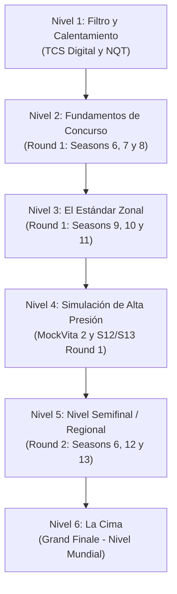

# Ruta Oficial de Preparación y Maestría: TCS CodeVita

Esta es la **Guía y Ruta Oficial de Entrenamiento** diseñada para guiarte paso a paso desde los fundamentos hasta el nivel de la **Grand Finale**, asegurando tu clasificación en cada fase y maximizando tus oportunidades de obtener ofertas de alto nivel (**TCS Digital** y **TCS Innovator / Turbo**).

---

## 1. Dominio de Sintaxis y Plantillas Esenciales por Lenguaje

En TCS CodeVita el tiempo es oro y la penalización por envíos erróneos o TLE (*Time Limit Exceeded*) es severa. A continuación se detallan las técnicas de sintaxis indispensables, plantillas de **Fast I/O** y estructuras que **debes dominar de memoria** en tu lenguaje de elección:

---

### A. C++ (C++17 / C++20) — *Lenguaje Más Recomendado*

C++ es el lenguaje estándar de oro en programación competitiva debido a su velocidad de ejecución y a su rica librería STL.

#### 1. Plantilla Universal con Fast I/O
```cpp
#include <iostream>
#include <vector>
#include <string>
#include <algorithm>
#include <map>
#include <unordered_map>
#include <set>
#include <unordered_set>
#include <queue>
#include <stack>
#include <cmath>
#include <iomanip>

using namespace std;

void fast_io() {
    ios_base::sync_with_stdio(false);
    cin.tie(NULL);
}

int main() {
    fast_io();
    // Tu codigo aqui
    return 0;
}
```

#### 2. Estructuras y Sintaxis Crítica que Debes Conocer
- **Contenedores STL Dinámicos**:
  - `vector<int> v; v.push_back(x); v.reserve(N);`
  - `pair<int, int>` y `tuple<int, int, int>` para empaquetar coordenadas o estados.
- **Diccionarios y Conjuntos Hash (Tiempo Promedio $O(1)$)**:
  - `unordered_map<string, int>` y `unordered_set<int>` (usar cuando no se requiera orden).
  - `map<int, int>` y `set<int>` (árboles rojo-negro, mantienen orden en $O(\log N)$).
- **Colas de Prioridad / Montículos (Heaps)**:
  - Max-Heap (por defecto): `priority_queue<int> pq;`
  - Min-Heap: `priority_queue<int, vector<int>, greater<int>> min_pq;`
  - Para Dijkstra con pares: `priority_queue<pair<long long, int>, vector<pair<long long, int>>, greater<pair<long long, int>>> pq;`
- **Algoritmos STL Imprescindibles**:
  - Ordenar: `sort(v.begin(), v.end());`
  - Ordenar con Lambda: `sort(v.begin(), v.end(), [](const auto &a, const auto &b){ return a.second < b.second; });`
  - Búsqueda Binaria: `lower_bound(v.begin(), v.end(), x)` (primer elemento $\ge x$) y `upper_bound(v.begin(), v.end(), x)` (primer elemento $> x$).
  - Permutaciones: `next_permutation(v.begin(), v.end());`
  - Suma acumulada rápida: `accumulate(v.begin(), v.end(), 0LL);`
- **Manejo de Números Grandes y Precisión**:
  - Tipos de 64 bits: use siempre `long long` (hasta $\approx 9 \times 10^{18}$).
  - Números de 128 bits en GCC: `__int128_t` (útil para multiplicaciones intermedias sin desbordamiento).
  - Formateo decimal estricto: `cout << fixed << setprecision(2) << ans << "\n";`

---

### B. Python (Python 3.8+) — *Excelente para Prototipado y BigInt*

Python es ideal para problemas matemáticos con números gigantes (aritmética de precisión infinita por defecto) y manipulación de texto.

#### 1. Plantilla Universal con Fast I/O
```python
import sys
from collections import deque, Counter, defaultdict
import heapq
import math

def solve():
    # Lectura masiva instantanea de todos los tokens
    input_data = sys.stdin.read().split()
    if not input_data:
        return
    
    # Procesar tokens secuencialmente
    # it = iter(input_data)
    # N = int(next(it))
    
if __name__ == "__main__":
    solve()
```

#### 2. Estructuras y Sintaxis Crítica que Debes Conocer
- **Fast I/O**: **Nunca uses `input()` en bucles de $10^5$ iteraciones** (provocará TLE). Usa `sys.stdin.read().split()` o `sys.stdin.readline`.
- **Cola Doble / BFS**: `from collections import deque`. `deque.popleft()` y `deque.append()` toman tiempo $O(1)$ (a diferencia de `list.pop(0)` que toma $O(N)$).
- **Montículos (Heapq)**:
  - Python solo tiene Min-Heap: `heapq.heappush(h, val)`, `heapq.heappop(h)`.
  - Para Max-Heap: almacena tuplas con signo negativo: `heapq.heappush(h, (-val, val))`.
- **Diccionarios con Valor por Defecto y Contadores**:
  - `freq = Counter(lista)` (conteo instantáneo de frecuencias).
  - `adj = defaultdict(list)` (listas de adyacencia de grafos limpias).
- **Módulo Matemático (`math`)**:
  - `math.gcd(a, b)` y `math.lcm(a, b)`.
  - `math.comb(n, k)` (coeficientes binomiales exactos $\binom{n}{k}$).
  - `math.isqrt(n)` (raíz cuadrada entera exacta sin errores de flotante).
- **Límite de Recursión para DFS**:
  - Por defecto Python limita la recursión a 1,000 llamadas.
  - En problemas de árboles o grafos profundos agrega al inicio:
    ```python
    import sys
    sys.setrecursionlimit(200000)
    ```

---

### C. Java (Java 11 / Java 17)

Java es robusto y cuenta con `BigInteger`, pero requiere evitar `Scanner` para entradas grandes.

#### 1. Plantilla con FastScanner
```java
import java.io.*;
import java.util.*;
import java.math.BigInteger;

public class Solution {
    static class FastScanner {
        BufferedReader br = new BufferedReader(new InputStreamReader(System.in));
        StringTokenizer st;

        String next() {
            while (st == null || !st.hasMoreTokens()) {
                try {
                    String line = br.readLine();
                    if (line == null) return null;
                    st = new StringTokenizer(line);
                } catch (IOException e) {
                    e.printStackTrace();
                }
            }
            return st.nextToken();
        }

        int nextInt() { return Integer.parseInt(next()); }
        long nextLong() { return Long.parseLong(next()); }
        double nextDouble() { return Double.parseDouble(next()); }
    }

    public static void main(String[] args) {
        FastScanner fs = new FastScanner();
        PrintWriter out = new PrintWriter(System.out);

        // Logica del problema
        
        out.flush();
    }
}
```

#### 2. Sintaxis Crítica que Debes Conocer
- **Nombre de Clase**: Siempre revisa si la plataforma exige `public class Solution` o `public class Main`.
- **Fast I/O**: `Scanner` es muy lento para $N \ge 10^5$. Usa `BufferedReader` y `PrintWriter`.
- **BigInteger**: `BigInteger a = new BigInteger(fs.next()); a = a.multiply(b).mod(MOD);`
- **Comparadores Personalizados**:
  ```java
  Arrays.sort(arr, (a, b) -> Integer.compare(a[0], b[0]));
  PriorityQueue<int[]> pq = new PriorityQueue<>((a, b) -> Integer.compare(a[1], b[1]));
  ```

---

## 2. Fase 0: Fundamentos Teóricos Obligatorios

Antes de resolver ejercicios de concurso, debes tener perfectamente claros estos 4 conceptos:

1. **La Regla de Oro de la Complejidad ($10^8$ operaciones/seg)**:
   - Si el límite de tiempo es de **1.0 segundo**:
     - $N \le 10$: $O(N!)$ o $O(2^N \cdot N)$ (Backtracking / DP con Bitmask).
     - $N \le 20$: $O(2^N)$ (Búsqueda exhaustiva, subconjuntos).
     - $N \le 500$: $O(N^3)$ (Floyd-Warshall, DP de matrices).
     - $N \le 5,000$: $O(N^2)$ (DP 2D, comparar todos los pares).
     - $N \le 2 \times 10^5$: $O(N \log N)$ o $O(N)$ (Ordenamiento, Two Pointers, Árboles, Dijkstra).
     - $N \le 10^9$: $O(\sqrt{N})$ o $O(\log N)$ (Teoría de números, Búsqueda Binaria).
2. **Aritmética Modular y Números Primos**:
   - Multiplicación con módulo: `(a * b) % MOD` (cuidado con desbordamientos intermedios en C++).
   - Inverso modular mediante el Pequeño Teorema de Fermat: $a^{-1} \equiv a^{MOD-2} \pmod{MOD}$ para $MOD$ primo.
   - Criba de Eratóstenes para primos hasta $10^7$ en $O(N \log \log N)$.
3. **Técnicas de Dos Punteros y Ventana Deslizante (Sliding Window)**:
   - Reducir complejidades de $O(N^2)$ a $O(N)$ manteniendo índices móviles sobre arreglos ordenados o secuencias continuas.
4. **Búsqueda Binaria sobre el Espacio de Respuestas**:
   - Si una función de viabilidad $f(X)$ es monótona (ej. "es posible completar el trabajo en $X$ minutos"), busca el $X$ óptimo en $O(\log(\text{rango}) \times \text{verificación})$.

---

## 3. La Ruta Oficial de Entrenamiento por Fases y Rondas

Sigue esta progresión estructurada paso a paso. No avances de nivel hasta dominar los ejercicios recomendados de cada etapa:



---

### 🟢 Nivel 1: Filtro y Calentamiento (TCS Digital y TCS NQT)
- **Objetivo**: Desarrollar fluidez de implementación, evitar errores de sintaxis y acostumbrarse a parsear entradas sin ayuda.
- **Conceptos**: Cadenas, arreglos, conteo de frecuencias, ordenamientos simples.
- **Ruta de Ejercicios en el Repositorio**:
  1. [`No-Season/TCS-Digital/Alphanumeric-Palindrome`](No-Season/TCS-Digital/Alphanumeric-Palindrome/)
  2. [`No-Season/TCS-Digital/Anagram`](No-Season/TCS-Digital/Anagram/)
  3. [`No-Season/TCS-Digital/Common-Prefix`](No-Season/TCS-Digital/Common-Prefix/)
  4. [`No-Season/TCS-Digital/Arrays-Rotation`](No-Season/TCS-Digital/Arrays-Rotation/)
  5. [`No-Season/TCS-NQT/[OFICIAL]-Pangram-Check`](No-Season/TCS-NQT/[OFICIAL]-Pangram-Check/)
  6. [`No-Season/TCS-NQT/[OFICIAL]-Typewriter-Challenge`](No-Season/TCS-NQT/[OFICIAL]-Typewriter-Challenge/)

---

### 🟡 Nivel 2: Fundamentos de Concurso (Round 1: Seasons 6, 7 y 8)
- **Objetivo**: Aprender a traducir narrativas extensas a modelos algorítmicos concretos.
- **Conceptos**: Simulación matemática, aritmética modular, lógica geométrica básica, componentes conexas.
- **Ruta de Ejercicios en el Repositorio**:
  1. [`Season-6/Round-1/[OFICIAL]-Base-6`](Season-6/Round-1/[OFICIAL]-Base-6/) ⭐ *(Cambio de base y ordenamiento)*
  2. [`Season-6/Round-1/[OFICIAL]-Kth-Largest-Factor`](Season-6/Round-1/[OFICIAL]-Kth-Largest-Factor/) ⭐ *(Divisores en $O(\sqrt{N})$)*
  3. [`Season-7/Round-1/[OFICIAL]-Bride-Hunting`](Season-7/Round-1/[OFICIAL]-Bride-Hunting/) ⭐ *(Simulación de cuadrícula y desempates)*
  4. [`Season-7/Round-1/[OFICIAL]-Jurrassic-Park`](Season-7/Round-1/[OFICIAL]-Jurrassic-Park/) ⭐ *(BFS multidireccional en laberinto)*
  5. [`Season-8/Round-1/[OFICIAL]-Coins-Required`](Season-8/Round-1/[OFICIAL]-Coins-Required/) ⭐ *(Descomposición voraz matemática)*
  6. [`Season-8/Round-1/[OFICIAL]-Friendcircle`](Season-8/Round-1/[OFICIAL]-Friendcircle/) ⭐ *(Grafos: componentes conexas con DFS/DSU)*
  7. [`Season-8/Round-1/[OFICIAL]-Island`](Season-8/Round-1/[OFICIAL]-Island/) ⭐ *(Perímetro de cuadrícula)*
  8. [`Season-8/Round-1/[OFICIAL]-Uncertain-Step`](Season-8/Round-1/[OFICIAL]-Uncertain-Step/) ⭐ *(Programación dinámica 1D con estados)*

---

### 🟠 Nivel 3: El Estándar Zonal (Round 1: Seasons 9, 10 y 11)
- **Objetivo**: Dominar la combinación de estructuras de datos y algoritmos de optimización para asegurar el pase directo al Round 2.
- **Conceptos**: Sweep-line de intervalos, pilas monótonas, DP clásica (Mochila, Coin Change), Colas de prioridad.
- **Ruta de Ejercicios en el Repositorio**:
  1. [`Season-9/Round-1/[OFICIAL]-Railwaystation`](Season-9/Round-1/[OFICIAL]-Railwaystation/) ⭐ *(Sweep-line de plataformas mínimas)*
  2. [`Season-9/Round-1/[OFICIAL]-Path-Through-Graph`](Season-9/Round-1/[OFICIAL]-Path-Through-Graph/) ⭐ *(Árboles y factorización de factores)*
  3. [`Season-9/Round-1/[OFICIAL]-Minimizethesum`](Season-9/Round-1/[OFICIAL]-Minimizethesum/) ⭐ *(Montículo / Max-Heap voraz)*
  4. [`Season-9/Round-1/[OFICIAL]-Primetimeagain`](Season-9/Round-1/[OFICIAL]-Primetimeagain/) ⭐ *(Criba de primos y congruencias horarias)*
  5. [`Season-10/Round-1/Classarrangement`](Season-10/Round-1/Classarrangement/) *(Permutaciones y conteo condicional)*
  6. [`Season-11/Round-1/[OFICIAL]-Largest-Gold-Ingot`](Season-11/Round-1/[OFICIAL]-Largest-Gold-Ingot/) ⭐ *(Pila monótona $O(N)$)*
  7. [`Season-11/Round-1/[OFICIAL]-Hedger`](Season-11/Round-1/[OFICIAL]-Hedger/) ⭐ *(Mochila fraccionaria voraz)*

---

### 🔴 Nivel 4: Simulación de Alta Presión (MockVita 2 y Seasons 12 y 13 Round 1)
- **Objetivo**: Resolver problemas recientes bajo las condiciones reales de la prueba moderna.
- **Conceptos**: Máquinas de estado, tableros matriciales, búsqueda binaria sobre respuesta, simulación de hardware y circuitos.
- **Ruta de Ejercicios en el Repositorio**:
  1. [`Season-9/MockVita-2/[OFICIAL]-Swayamvar`](Season-9/MockVita-2/[OFICIAL]-Swayamvar/) ⭐ *(Colas y emparejamiento)*
  2. [`Season-8/MockVita-2/[OFICIAL]-Bad-Permutation`](Season-8/MockVita-2/[OFICIAL]-Bad-Permutation/) ⭐ *(Combinatoria y conteo modular)*
  3. [`Season-12/Round-1/[OFICIAL]-Buzz-Day-Sale`](Season-12/Round-1/[OFICIAL]-Buzz-Day-Sale/) ⭐ *(Problema de la mochila con bonificación)*
  4. [`Season-12/Round-1/[OFICIAL]-Shannon-Circuits`](Season-12/Round-1/[OFICIAL]-Shannon-Circuits/) ⭐ *(Simulación de compuertas lógicas en tiempo discreto)*
  5. [`Season-12/Round-1/[OFICIAL]-Gravity-And-Lifts`](Season-12/Round-1/[OFICIAL]-Gravity-And-Lifts/) ⭐ *(BFS con aceleración por gravedad)*
  6. [`Season-13/Round-1/[OFICIAL]-Order-It`](Season-13/Round-1/[OFICIAL]-Order-It/) ⭐ *(Parsing y ordenamiento lexicográfico complejo)*
  7. [`Season-13/Round-1/[OFICIAL]-Max-Match-Box`](Season-13/Round-1/[OFICIAL]-Max-Match-Box/) ⭐ *(Geometría 3D y empaquetamiento)*
  8. [`Season-13/Round-1/[OFICIAL]-F1-Logistics`](Season-13/Round-1/[OFICIAL]-F1-Logistics/) ⭐ *(Optimización de rutas con penalizaciones)*

---

### 🟣 Nivel 5: Nivel Semifinal y Regional (Round 2: Seasons 6, 12 y 13)
- **Objetivo**: Enfrentar problemas multidimensionales donde 1 solo problema resuelto puede catapultarte a los mejores puestos nacionales.
- **Conceptos**: Dijkstra sobre mallas ponderadas, geometrías no convexas, decodificación matricial, programación dinámica con máscaras de bits.
- **Ruta de Ejercicios en el Repositorio**:
  1. [`Season-6/Round-2/[OFICIAL]-Counting-Rectangle`](Season-6/Round-2/[OFICIAL]-Counting-Rectangle/) ⭐ *(Geometría y hashing de pares diagonales)*
  2. [`Season-6/Round-2/[OFICIAL]-Shortest-Path-In-Maze`](Season-6/Round-2/[OFICIAL]-Shortest-Path-In-Maze/) ⭐ *(BFS/Dijkstra con obstáculos móviles)*
  3. [`Season-12/Round-2/[OFICIAL]-Maximum-Strength`](Season-12/Round-2/[OFICIAL]-Maximum-Strength/) ⭐ *(Dijkstra sobre daño de tiburones)*
  4. [`Season-12/Round-2/[OFICIAL]-Gliitch-Detection`](Season-12/Round-2/[OFICIAL]-Gliitch-Detection/) ⭐ *(Bitmask de display de 7 segmentos y corrección de ecuaciones)*
  5. [`Season-12/Round-2/[OFICIAL]-Minimum-Office-Hours`](Season-12/Round-2/[OFICIAL]-Minimum-Office-Hours/) ⭐ *(Fusión y barrido de intervalos con tailgating)*
  6. [`Season-13/Round-2/[OFICIAL]-Ascii-Homes`](Season-13/Round-2/[OFICIAL]-Ascii-Homes/) ⭐ *(Parsing visual 2D y reconocimiento de patrones)*
  7. [`Season-13/Round-2/[OFICIAL]-Wall-Shooter`](Season-13/Round-2/[OFICIAL]-Wall-Shooter/) ⭐ *(Física de reflexiones y cinemática)*
  8. [`Season-13/Round-2/[OFICIAL]-Cubemid`](Season-13/Round-2/[OFICIAL]-Cubemid/) ⭐ *(Manipulación de matrices 3D)*

---

### 🏆 Nivel 6: La Cima (Grand Finale — Final Mundial)
- **Objetivo**: Entrenar para la final mundial presencial contra los 50 mejores competidores del planeta.
- **Conceptos**: Flujo máximo de costo mínimo (MCMF), Heavy-Light Decomposition en árboles, triangulación de polígonos con DP $O(N^3)$.
- **Guía de Estudio**: Estudia a fondo los 4 problemas resueltos y el análisis técnico en **[`GRAND_FINALE_PROBLEMS.md`](GRAND_FINALE_PROBLEMS.md)**.

---

## 4. Estrategia de Combate Durante las 6 Horas del Examen

### La Regla de los Primeros 20 Minutos (Lectura Estratégica)
1. **No abras el editor de código inmediatamente**.
2. Lee los 6 problemas completos y clasifícalos:
   - **Verde**: Problema directo de simulación, strings o matemáticas elementales (Resolver en los primeros 45 min).
   - **Amarillo**: Problema con algoritmo claro (BFS, DP, Sweep-line, Two Pointers) pero con enunciado largo o muchos casos borde (Resolver en las siguientes 2 horas).
   - **Rojo**: Problema complejo de grafos pesados, geometría avanzada o simulación enrevesada (Abordar solo tras tener 2 o 3 problemas verdes/amarillos resueltos y aceptados).

### Gestión de Envíos y Penalización por Tiempo
- **Cero envíos a ciegas**: Cada intento fallido agrega una penalización de tiempo de 20 minutos en el desempate.
- **Prueba tus propios casos extremos antes de presionar Submit**:
  - ¿Qué pasa si $N = 1$ o $N = 0$?
  - ¿Qué pasa si todos los números son negativos o idénticos?
  - ¿Qué pasa si la respuesta no cabe en 32 bits?
- **Formato de Salida Quirúrgico**:
  - Nunca agregues texto como `"El resultado es: "`.
  - Asegúrate de imprimir un salto de línea `
` al final si el enunciado lo exige.
  - Verifica si los decimales se redondean (`round()`) o se truncan.
